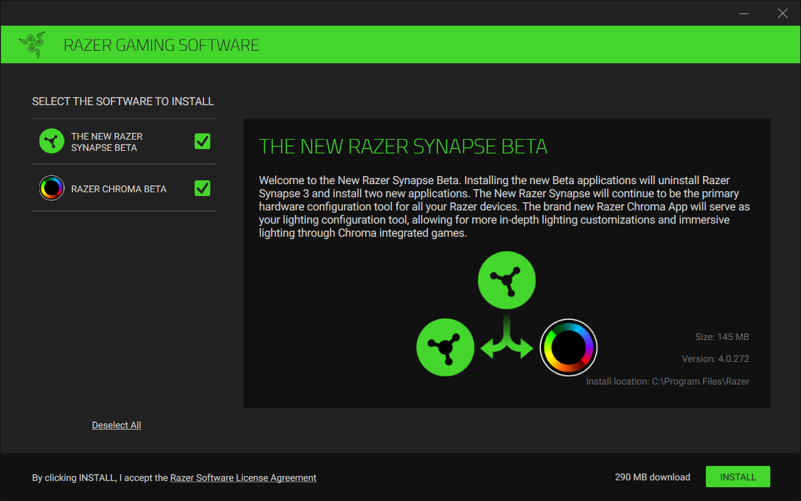

# C++ SDK - Chroma Animation Sample App

**Table of Contents**

* [See Also](#see-also)
* [Quick Start](#quick-start)
* [About](#about)

## See Also

**Docs:**

- [Chroma Animation Guide](http://chroma.razer.com/ChromaGuide/) - Visual examples of the Chroma Animation API methods

**Apps:**

- [ChromaClientForDiscord](https://github.com/tgraupmann/ChromaDiscordApp) - Add Chroma lighting to the Discord App events

- [ChromaClientForTwitch](https://github.com/tgraupmann/ChromaTwitchExtension) - Add Chroma lighting to the Twitch streaming experience

**Plugins:**

- [CChromaEditor](https://github.com/RazerOfficial/CChromaEditor) - C++ native MFC library for playing and editing Chroma animations

- [ClickTeamFusion_ChromaSDK](https://github.com/RazerOfficial/ClickTeamFusion_ChromaSDK) - Click Team Fusion Chroma SDK Extension for playing Chroma animations

- [GameMakerChromaExtension](https://github.com/RazerOfficial/GameMakerChromaExtension) - GameMaker extension to control lighting for Razer Chroma

- [Godot_ChromaSDK](https://github.com/RazerOfficial/Godot_ChromaSDK) - Godot native library for playing Chroma animations

- [HTML5ChromaSDK](https://github.com/RazerOfficial/HTML5ChromaSDK) - JavaScript library for playing Chroma animations

- [UE4_XDK_SampleApp](https://github.com/razerofficial/UE4_XDK_SampleApp) - UE4 Chroma samples and runtime module with Blueprint library for the ChromaSDK

- [UnityNativeChromaSDK](https://github.com/RazerOfficial/UnityNativeChromaSDK) - Unity native library for the ChromaSDK

## Quick Start ##

* Install [Synapse](https://www.razer.com/synapse-3)

* Make sure the Chroma Connect module is installed.

* If you don't have Chroma hardware, you can see Chroma effects with the [Chroma Emulator](https://github.com/razerofficial/ChromaEmulator)

## About

The `CSDK Sample App` is a C++ console app that shows the animations from the [Chroma Animation Guide](http://chroma.razer.com/ChromaGuide/).

**Screenshot:**

